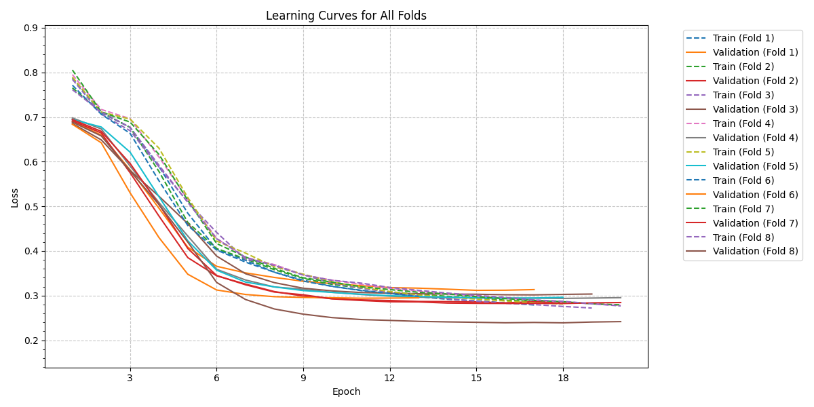
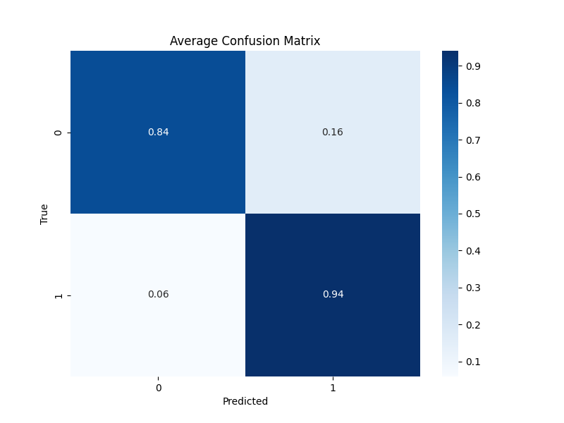
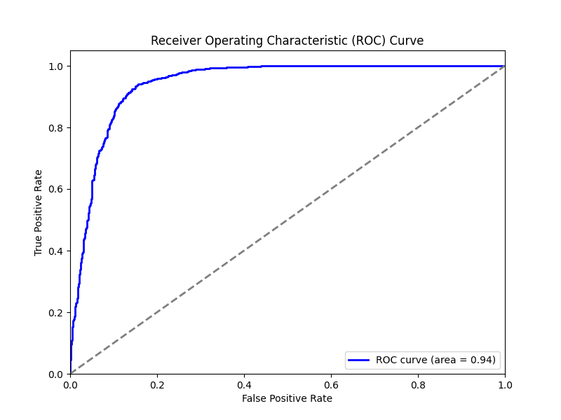

# Student Dropout and Academic Success Prediction

This repository contains a dataset and a comprehensive analysis framework for predicting student dropout and academic performance using various machine learning and deep learning models.

## Main Objective
The primary objective of this analysis is to explore the factors associated with student dropout, develop predictive models, and conduct statistical analyses to provide insights and predictive capabilities. The focus will be on improving prediction accuracy and providing valuable information to stakeholders, such as educational institutions and policymakers.

## Data Summary
The dataset includes socio-economic factors and academic performance. The data covers a wide range of features essential for understanding and predicting student dropout and academic success.

## About the Dataset

This dataset contains extensive information for students enrolled in various undergraduate degrees at a higher education institution. The dataset includes the following features:

### Student Information
- **Student ID**: A unique identifier assigned to each student (omitted).

### Demographic Details
- **Age at enrollment**: The age of the students at the time of enrollment.
- **Gender**: Gender of the students.
- **Marital status**: The marital status of the students.
- **International**: Whether the student is an international student.

### Socio-Economic Factors
- **Mother's qualification**: The qualification of the student's mother.
- **Father's qualification**: The qualification of the student's father.
- **Mother's occupation**: The occupation of the student's mother.
- **Father's occupation**: The occupation of the student's father.

### Academic Information
- **Course**: The course taken by the student.
- **Daytime/evening attendance**: Whether the student attends classes during the day or in the evening.
- **Previous qualification**: The qualification obtained by the student before enrolling in higher education.
- **Educational special needs**: Whether the student has any special educational needs.
- **Scholarship holder**: Whether the student is a scholarship holder.
- **Curricular units 1st sem (credited)**: The number of curricular units credited by the student in the first semester.
- **Curricular units 1st sem (enrolled)**: The number of curricular units enrolled by the student in the first semester.
- **Curricular units 1st sem (evaluations)**: The number of curricular units evaluated by the student in the first semester.
- **Curricular units 1st sem (approved)**: The number of curricular units approved by the student in the first semester.
- **Curricular units 1st sem (grade)**: The grades obtained in the first semester.
  
Using this dataset, researchers can investigate two key questions:    

- Which specific predictive factors are linked with student dropout or completion?
- How do different features interact with each other?   

For example, researchers could explore if there are any characteristics (gender, age at enrollment, etc.) that are associated with higher student success rates, as well as understand what implications poverty has for educational outcomes. By answering these questions, research insights are generated that can provide critical information for administrators on formulating strategies that promote successful degree completion among students from diverse backgrounds in their institutions.

- **Prediction of Student Retention**: This dataset can be used to develop predictive models that can identify student risk factors for dropout and take early interventions to improve student retention rates.
- **Improved Academic Performance**: By using this data, higher education institutions could better understand their students' academic progress and identify areas of improvement from both an individual and institutional perspective. This will enable them to develop targeted courses, activities, or initiatives that enhance academic performance more effectively and efficiently.

## Data Exploration and Cleaning
Initial data exploration involved checking for missing values, outliers, and inconsistencies. Feature engineering steps included scaling numerical features, one-hot encoding categorical features, and undersampling to address class imbalance.

Class distribution before resampling:
| Target       | Samples |
|--------------|---------|
| Graduate (1) | 2209    |
| Dropout (0)  | 1421    |

Class distribution after resampling:
| Target       | Samples |
|--------------|---------|
| Graduate (1) | 1421    |
| Dropout (0)  | 1421    |

## Features Selection
The SelectKBest method from the sklearn.feature_selection module is a feature selection technique that selects the top k features based on a statistical measure of their relevance to the target variable.

Selected As top 10 Features: 
- Gender
- Scholarship holder
- Age at enrollment
- Curricular units 1st sem (enrolled)
- Curricular units 1st sem (approved)
- Curricular units 1st sem (grade)
- Curricular units 2nd sem (enrolled)
- Curricular units 2nd sem (approved)
- Curricular units 2nd sem (grade)
- Course 12
----------------------------------------------------------------------------

<p align="center">
  
</p>

Here we can see for example the distribution of each of the top features. furthermore, we can see that Gender and Age at enrollment are negatively correlated with Graduation, while all other features are positively correlated.  

----------------------------------------------------------------------------

## Model Training and Evaluation
We used various machine learning models and conducted a grid search to find the best hyperparameters. Stratified cross-validation with 8 folds and downsampling for preprocessing were utilized to ensure balanced class distribution.

We also experimented with simpler models such as Logistic Regression, K-Nearest Neighbors, Support Vector Machine, Random Forest, and Gradient Boosting with cross-validation using 8 folds.

## Key Findings and Insights

### Neural Network (NN) (All Features)
| Class        | Precision | Recall | F1-Score | Support |
|--------------|-----------|--------|----------|---------|
| Dropout (0)  | 0.933     | 0.841  | 0.885    | 1421    |
| Graduate (1) | 0.855     | 0.940  | 0.896    | 1421    |

### Best Configuration
- **Layers**: [16, 32, 64, 128]
- **Learning Rate**: 0.001
- **Batch Size**: 64
- **F1 Score**: 0.8960

----------------------------------------------------------------------------

<p align="center">
  
</p>

<p align="center">
  
  
</p>

----------------------------------------------------------------------------

### Comparison of F1 Scores
| Complexity | Model                   | Parameters (All Features)  | Parameters (Top 10 Features) | F1 Score (All Features) | F1 Score (Top 10 Features) |
|------------|-------------------------|----------------------------|------------------------------|-------------------------|----------------------------|
| 1          | Logistic Regression     | C = 0.5                    | C = 0.1                      | 0.894                   | 0.893                      |
| 2          | K-Nearest Neighbors     | k = 25                     | k = 25                       | 0.865                   | 0.880                      |
| 3          | Support Vector Machine  | C = 0.1 (Linear)           | C = 0.1 (Linear)             | 0.895                   | 0.894                      |
| 4          | Random Forest           | Estimators = 500           | Estimators = 250             | 0.881                   | 0.876                      |
| 5          | Gradient Boosting       | Estimators = 100           | Estimators = 100             | 0.890                   | 0.887                      |
| 6          | Neural Network          | Layers = [16, 32, 64, 128] |                              |                         | 0.895                     |

### Top 10 Features Importance (Random Forest)
| Feature                             | Importance |
|-------------------------------------|------------|
| Curricular units 2nd sem (approved) | 0.1802     |
| Curricular units 1st sem (approved) | 0.1165     |
| Curricular units 2nd sem (grade)    | 0.1074     |
| Curricular units 1st sem (grade)    | 0.0936     |
| Age at enrollment                   | 0.0495     |
| Curricular units 2nd sem (evaluations)| 0.0452     |
| Curricular units 1st sem (evaluations)| 0.0387     |
| Scholarship holder                  | 0.0334     |
| Curricular units 2nd sem (enrolled) | 0.0209     |
| Gender                              | 0.0206     |
   
### Recommended Model
The best-performing model was the Neural Network, achieving an F1 score of 0.895. This model demonstrated superior performance in predicting student's dropout.  
   
## Conclusion
This analysis provides a robust framework for predicting student dropout and academic performance using various data features. The findings offer valuable insights into the key factors associated with student success and dropout rates and demonstrate the potential of machine learning models in supporting educational decision-making.

Future analysis could involve:
- **Incorporating Additional Data**: Including more detailed personal, demographic and socio-economic data.
- **Model Refinement**: Experimenting with other machine learning algorithms or ensemble methods.
- **Institutional Implementation**: Collaborating with educational institutions to implement the model's predictions for early interventions.

## Setup

### Scripts
- `data_preprocessing.py`: Loads and preprocesses the data, including scaling and resampling.
- `feature_selection.py`: Selects the top 10 features using `SelectKBest`.
- `simple_model_evaluation.py`: Evaluates simple models using all features and the top 10 features, saving the best F1 scores.
- `feature_importance.py`: Trains a Random Forest model and prints the feature importance.
- `layer_configurations.py`: Generates layer configurations and learning rates for the neural network.
- `neural_network.py`: Trains and evaluates a flexible neural network model using the best configurations.
- `student_churn_main.py`: Main script to run all the above scripts in the correct order.

### How to Run

1. Clone the repository:
    ```bash
    git clone https://github.com/reab5555/student-dropout-prediction.git
    cd student-dropout-prediction
    ```

2. Install the required packages:
    ```bash
    pip install pandas numpy scikit-learn imbalanced-learn tqdm matplotlib seaborn tabulate torch
    ```

3. Ensure the data file `student_dataset.csv` is in the correct path as specified in the `data_preprocessing.py` script.

4. Run the main script:
    ```bash
    python student_churn_main.py
    ```

### License

This project is licensed under the MIT License. See the `LICENSE` file for details.
